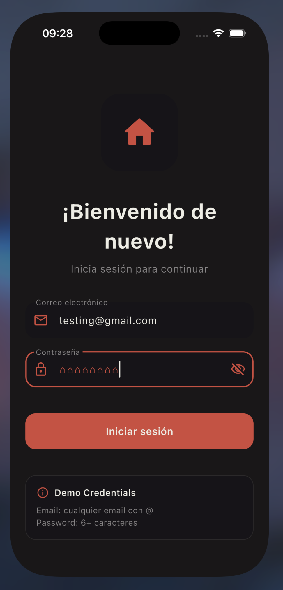
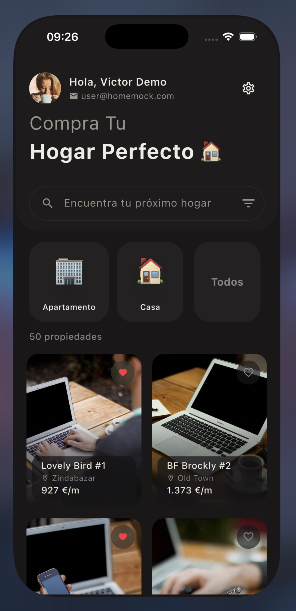
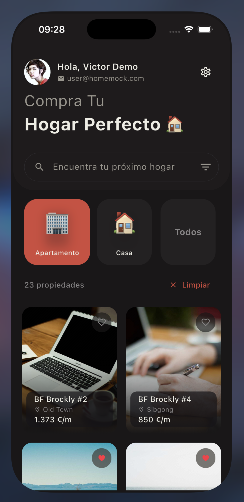
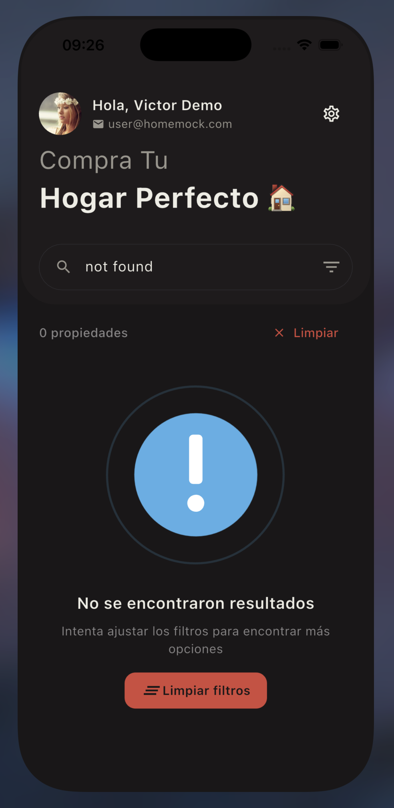
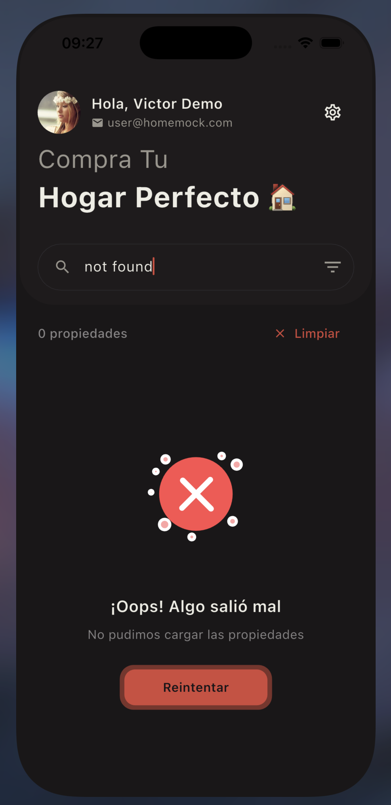

# 🏠 Home Mock - Flutter Property Finder App

Una aplicación Flutter moderna para buscar y explorar propiedades inmobiliarias con arquitectura limpia, gestión de estado con BLoC y diseño Material Design 3.

---

## 📋 Tabla de Contenidos

- [Cómo Correr](#-cómo-correr)
- [Paquetes Usados](#-paquetes-usados)
- [Decisiones Técnicas](#-decisiones-técnicas)
- [Limitaciones](#-limitaciones)
- [Capturas de Pantalla](#-capturas-de-pantalla)
- [Arquitectura](#-arquitectura)

---

## 🚀 Cómo Correr

### Prerrequisitos
- Flutter SDK 3.9.2 o superior
- Dart SDK compatible
- Android Studio / VS Code / Xcode (para iOS)

### Instalación

1. **Clonar el repositorio**
```bash
git clone <repository-url>
cd home_mock
```

2. **Instalar dependencias**
```bash
flutter pub get
```

3. **Generar código (Freezed, JSON Serializable, Assets)**
```bash
dart run build_runner build --delete-conflicting-outputs
```

4. **Ejecutar la aplicación**
```bash
# En modo debug
flutter run

# En modo release
flutter run --release

# Para una plataforma específica
flutter run -d chrome          # Web
flutter run -d macos           # macOS
flutter run -d <device-id>     # Dispositivo específico
```

5. **Credenciales de prueba (Login)**
```
Email: cualquier email válido (ej: test@example.com)
Password: cualquier contraseña
```

---

## 📦 Paquetes Usados

### Core / Estado
- **`flutter_bloc ^9.1.1`** - Gestión de estado reactiva con patrón BLoC
- **`equatable ^2.0.7`** - Comparación de objetos para estados inmutables
- **`get_it ^8.2.0`** - Inyección de dependencias (Service Locator)

### Navegación
- **`go_router ^16.2.4`** - Navegación declarativa con soporte para deep linking

### Modelos y Serialización
- **`freezed ^3.2.3`** - Generación de modelos inmutables con copyWith
- **`freezed_annotation ^3.1.0`** - Anotaciones para Freezed
- **`json_annotation ^4.9.0`** - Serialización JSON
- **`json_serializable ^6.11.1`** - Generador de código para JSON

### UI/UX
- **`cached_network_image ^3.4.1`** - Cache inteligente de imágenes
- **`animate_do ^4.2.0`** - Animaciones predefinidas (FadeIn, SlideIn, etc.)
- **`flutter_motionly ^0.0.7`** - Componentes animados personalizados
- **`lottie ^3.3.2`** - Animaciones Lottie (JSON)
- **`animated_text_kit ^4.3.0`** - Animaciones de texto

### Internacionalización
- **`flutter_localizations`** - Soporte de localización (SDK)
- **`intl ^0.20.2`** - Internacionalización y formato de fechas/números

### Almacenamiento
- **`shared_preferences ^2.5.3`** - Persistencia local (configuraciones)
- **`flutter_secure_storage ^9.2.2`** - Almacenamiento seguro (tokens)

### Utilidades
- **`screen_corner_radius ^3.0.0`** - Detección de esquinas redondeadas del dispositivo
- **`flutter_gen_runner ^5.12.0`** - Generación de código para assets

### Testing
- **`flutter_test`** - Framework de testing (SDK)
- **`bloc_test ^10.0.0`** - Testing para BLoCs
- **`mocktail ^1.0.0`** - Mocking para tests

### Desarrollo
- **`flutter_lints ^5.0.0`** - Reglas de linting recomendadas
- **`build_runner ^2.4.13`** - Generador de código
- **`flutter_launcher_icons ^0.14.4`** - Generación de iconos
- **`flutter_native_splash ^2.4.6`** - Pantalla de carga nativa

---

## 💡 Decisiones Técnicas

### Arquitectura y Patrones
- **Arquitectura en capas** (Presentation → Service → Repository → API) para separación de responsabilidades
- **BLoC pattern** para gestión de estado predecible y testeable
- **Repository pattern** para abstraer la fuente de datos
- **Dependency Injection** con GetIt para desacoplamiento
- **Immutable models** con Freezed para seguridad de tipos

### Gestión de Estado
- **BLoC** para estado complejo (HomesBloc, AuthBloc, SettingsBloc)
- **Equatable** para comparaciones eficientes de estados

### UI/UX
- **Material Design 3** como base del diseño
- **Sistema de constantes** (AppDurations, AppRadius, AppSpacing) para mantener consistencia
- **Tema personalizado** con soporte completo de modo oscuro
- **Hero animations** para transiciones fluidas entre pantallas
- **Shimmer loading** para mejor experiencia de carga

### Datos y Persistencia
- **API simulada** con datos mockeados para desarrollo sin backend
- **SharedPreferences** para configuraciones de usuario (idioma, tema, moneda)
- **FlutterSecureStorage** para tokens de autenticación
- **Caché de imágenes** para optimizar rendimiento y reducir consumo de datos

### Localización
- **Soporte multiidioma** (Español e Inglés)
- **l10n automático** con generación de código
- **Formato de moneda** dinámico según configuración

### Testing
- **Unit tests** para BLoCs y lógica de negocio
- **Widget tests** para componentes UI
- **Integration tests** para flujos completos
- **Mocking** con Mocktail para aislar dependencias

### Performance
- **Lazy loading** de imágenes y datos
- **Const constructors** donde es posible
- **Debouncing** en búsquedas (300ms) para reducir operaciones

---

## ⚠️ Limitaciones

### Backend y Datos
- **Sin persistencia real** - Los favoritos y cambios solo persisten en memoria durante la sesión
- **Login simulado** - Acepta cualquier credencial
- **Datos limitados** - Solo 50 propiedades

### Funcionalidades
- **Sin checkout real** - El botón de compra es solo UI, no procesa pagos

---

## 📱 Capturas de Pantalla

### 1. Login
Pantalla de autenticación con validación de formulario y animaciones.



### 2. Home - Lista de Propiedades
Vista principal con lista de propiedades, búsqueda y filtros por categoría.



### 3. Home - Categoría Seleccionada
Filtrado activo por categoría (Apartamentos/Casas).



### 4. Estado Vacío
Pantalla mostrada cuando no hay resultados para la búsqueda/filtros aplicados.



### 5. Estado de Error
Manejo de errores con opción de reintentar.



---

## 🏗️ Arquitectura

```
lib/
├── core/                           # Configuración y utilidades base
│   ├── constants/                  # Constantes (durations, spacing, radius, ui)
│   ├── localization/              # Configuración de idiomas
│   ├── locator.dart               # Dependency Injection (GetIt)
│   ├── logger.dart                # Sistema de logs
│   ├── router/                    # Configuración de navegación (GoRouter)
│   ├── theme.dart                 # Sistema de temas y colores
│   └── utils/                     # Utilidades (formatters, feedback)
│
├── data/                          # Capa de datos
│   ├── api/                       # APIs (simuladas)
│   │   └── home_api.dart         # API de propiedades
│   └── repository/                # Repositorios
│       ├── auth_repository.dart   # Repositorio de autenticación
│       └── home_repository.dart   # Repositorio de propiedades
│
├── model/                         # Modelos de datos
│   └── entity/                    # Entidades del dominio
│       ├── auth_status.dart      # Estados de autenticación
│       ├── auth_token.dart       # Token de sesión (Freezed)
│       ├── item.dart             # Modelo de propiedad (Freezed)
│       ├── owner.dart            # Modelo de propietario (Freezed)
│       ├── settings.dart         # Configuración de usuario
│       └── user.dart             # Modelo de usuario (Freezed)
│
├── presentation/                  # Capa de presentación
│   ├── page/                      # Pantallas completas
│   │   ├── details_page.dart     # Detalle de propiedad
│   │   ├── home_page.dart        # Pantalla principal
│   │   ├── login_page.dart       # Pantalla de login
│   │   ├── settings_page.dart    # Configuración
│   │   └── splash_page.dart      # Splash screen
│   │
│   ├── state/                     # BLoCs (Estado + Eventos)
│   │   ├── auth/                  # AuthBloc
│   │   ├── home/                  # HomesBloc
│   │   └── settings/              # SettingsBloc
│   │
│   └── widget/                    # Widgets reutilizables
│       ├── cached_image.dart     # Imagen con cache
│       ├── like_button.dart      # Botón de favorito animado
│       └── shimmer_loading.dart  # Skeleton loader
│
├── service/                       # Capa de servicios (lógica de negocio)
│   ├── auth_service.dart         # Servicio de autenticación
│   └── home_service.dart         # Servicio de propiedades
│
├── l10n/                          # Archivos de localización generados
│   ├── app_en.arb                # Traducciones en inglés
│   └── app_es.arb                # Traducciones en español
│
└── gen/                           # Código generado
    └── assets.gen.dart            # Assets tipados
```

### Flujo de Datos

```
UI (Widget) 
    ↓ dispatch event
BLoC (Business Logic)
    ↓ calls
Service (Domain Logic)
    ↓ calls  
Repository (Data Abstraction)
    ↓ calls
API / Data Source (Mock or Real)
    ↓ returns data
Repository
    ↓ returns
Service
    ↓ emits
BLoC (new State)
    ↓ rebuilds
UI (Widget)
```

---

## 👨‍💻 Desarrollo

Este proyecto demuestra:
- ✅ Arquitectura limpia y escalable
- ✅ Gestión de estado profesional con BLoC
- ✅ UI/UX moderna con Material Design 3
- ✅ Código mantenible con constantes y separación de responsabilidades
- ✅ Testing de lógica de negocio
- ✅ Internacionalización completa
- ✅ Buenas prácticas de Flutter/Dart


